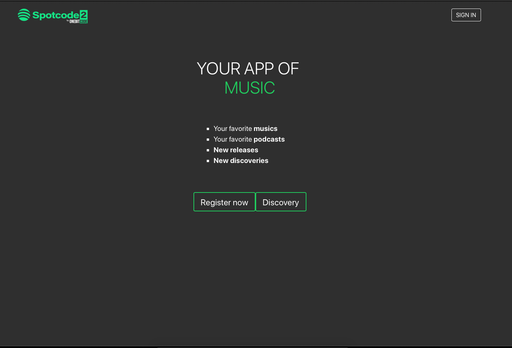
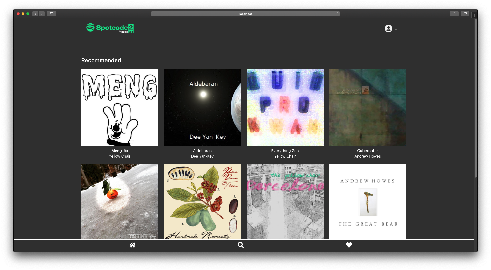
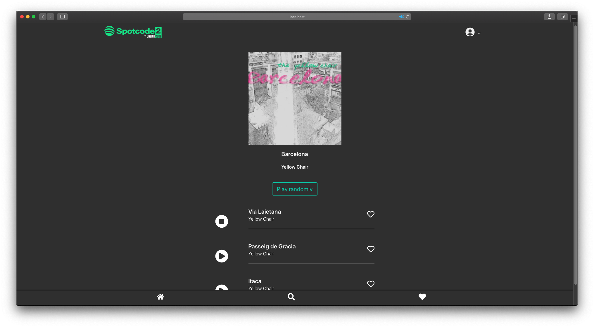
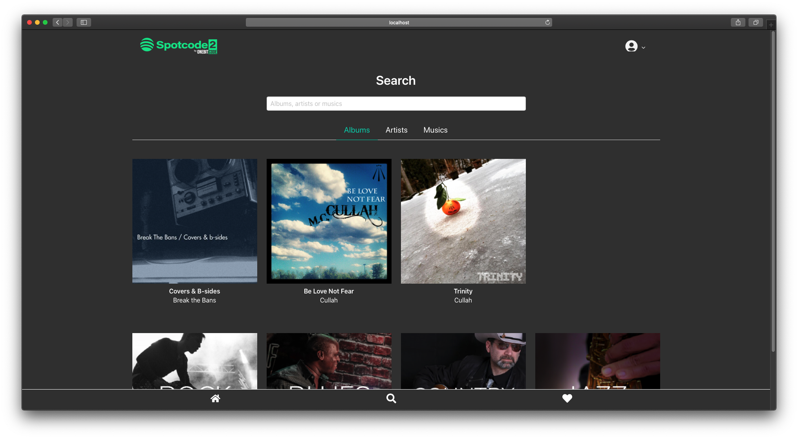

# Spotcode - PWA based on Spotify

PWA with Ruby on Rails + ReactJS

### Initial screen, first page of the APP:

### Home screen with random recommendation:

### See and listen to musics from an album:

### Search by text (albums, artists, musics) or genders:

### Search result albums, artists and musics:

### Favorites Albums, Artists and Musics per user:

