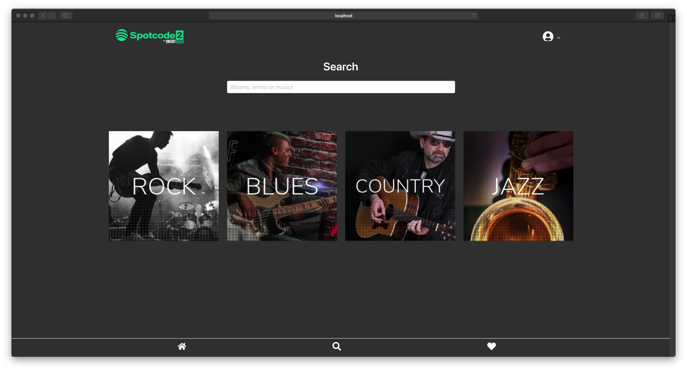
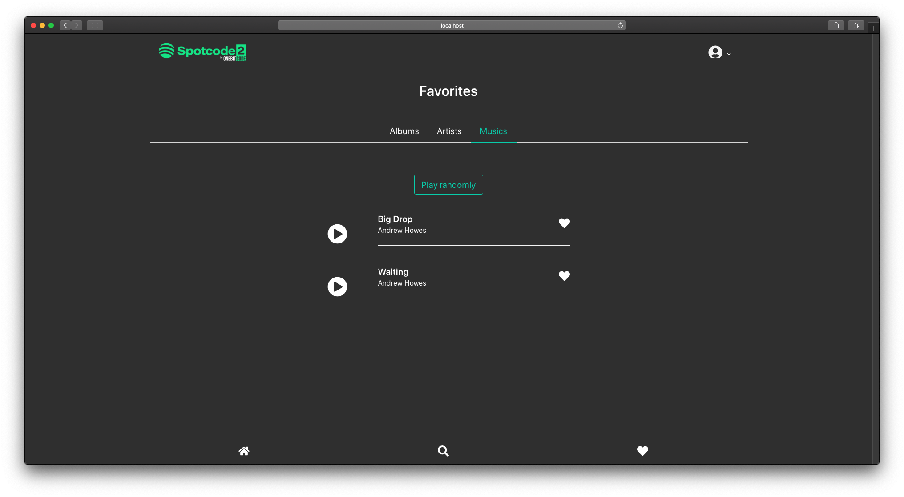

# Spotcode - PWA based on Spotify

PWA with Ruby on Rails + ReactJS

### Initial screen, first page of the APP:

### Home screen with random recommendation:

### See musics from an album:

### Search by text or gender:

### Search result Albums, Artists and Musics:

### Favorites Albums, Artists and Musics per user:

